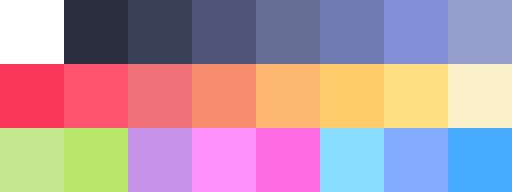

Sublimate
=========

> :scroll:
> This version currently supports [GMEdit](https://yellowafterlife.itch.io/gmedit), [ConEmu](https://conemu.github.io/), [Textadept](https://orbitalquark.github.io/textadept/), and [Pomotroid](https://splode.github.io/pomotroid/).

**Sublimate** is a dark theme, based on Palenight, and hopefully will be versioned for  all of my editors of choice, for maximum Pavlovian conditioning.
I've been developing for some time now, but only now am starting to find it in a state I can share.

> _Here's a look at the goods..._

---

The goal behind **Sublimate** is to create a version for all code editors that I use, and associate the similar parts of many different coding languages to similar colors. I have versions for Python's [IDLE](https://docs.python.org/3/library/idle.html?highlight=idle), [Sublime Text](https://www.sublimetext.com/), and [Game Maker Studio](https://docs2.yoyogames.com).

**It's not done, and there will be changes going forward**, but I thought I'd share this beta version as it is now.

---

Docs for Each Application
-------------------------

+ [GMEdit](themes/gmedit)
+ [Pomotroid](themes/pomotroid)

Notes
---------------------------

+ Colors in **Textadept** are in `BBGGRR` format, reversed from the usual `RRGGBB`!

