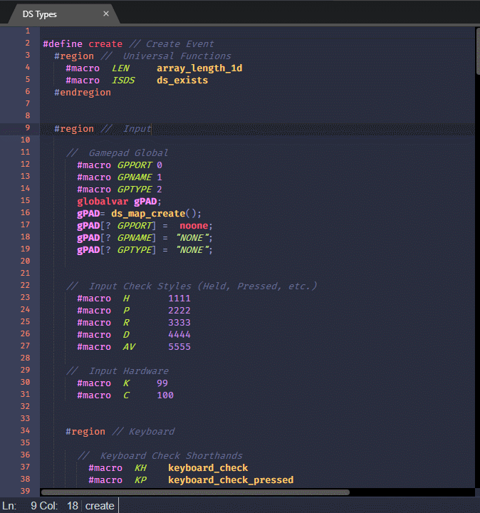
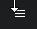

# Sublimate in GMEdit

1. Download or clone this git, and run GMEdit.
2. Click the `OPTIONS` button along the top of the application.
    + It looks like this:
    + 
3. Now click the `PREFERENCES` option, towards the bottom of the popup.
4. In the preferneces window that just popped up, you should see some themes to select.
    + Sublimate won't be there, but we're going to fix that! :jack_o_lantern:
5. Click the _highlighted_ text that reads, `manage`, right beside the `THEME` heading
    + This should have opened an explorer window
        - If you have other themes already, there will be folders here with their names
        - If you don't have other themes, don't sweat it, just follow along!
6. Create a new folder here called `Sublimate`
7. Open a second explorer window, and locate the zip file you downloaded/the git you cloned.
8. Find the folder at the path: `themes/gmedit`
9. Highlight the two files here
    + They should be called: `config.json` & `Sublimate.css`
10. Press <kbd>ctrl + c</kbd> or just **right click; copy**.
11. Move back over to that new folder you made, and paste the two files there!
    + You can do this by using the keyboard shortcut <kbd>ctrl + v</kbd>, or, **right click; paste**.
12. Back in **GMEdit**, scroll down to the bottom of the `PREFERENCES` window.
13. Find the bottom-most heading labeled `OTHER USEFUL THINGS`
14. Click the option just below called **Reload GMEdit**
15. When the program opens again, go back into `PREFERENCES`
16. You should now see a radial button with `Sublimate` as an option!
17. Select it, and enjoy!
