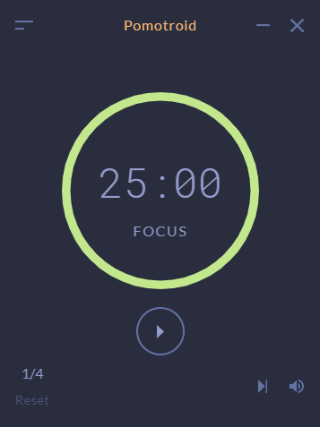

# Sublimate in Pomotroid

[Pomotroid][Pomo] is a **time management application** that runs on multiple OS's. It's built on the prinicples put forward by the [Pomodoro Technique][PomoTime].

Usage
-------------

There are perfect instructions [here][PomoThemes] on how to use a custom theme, but here's a quick rundown for Windows users anyway.

> _Make sure you've installed [Pomotroid][Pomo] before doing the following... :weary:_

1. Press <kbd>WIN</kbd> + <kbd>R</kbd>
2. Type `%APPDATA%/pomotroid/themes`.
3. **Copy & Paste** the file `Sublimate.json` from the `Pomotroid` folder in the respository.
   - If you have Pomotroid running, close it and relaunch.

**Sublimate will now be usable by scrolling to the bottom of the themes list!**

:grin:

[PomoThemes]:https://github.com/Splode/pomotroid/blob/master/docs/themes/themes.md
[Pomo]:https://splode.github.io/pomotroid/
[PomoTime]:https://en.wikipedia.org/wiki/Pomodoro_Technique

